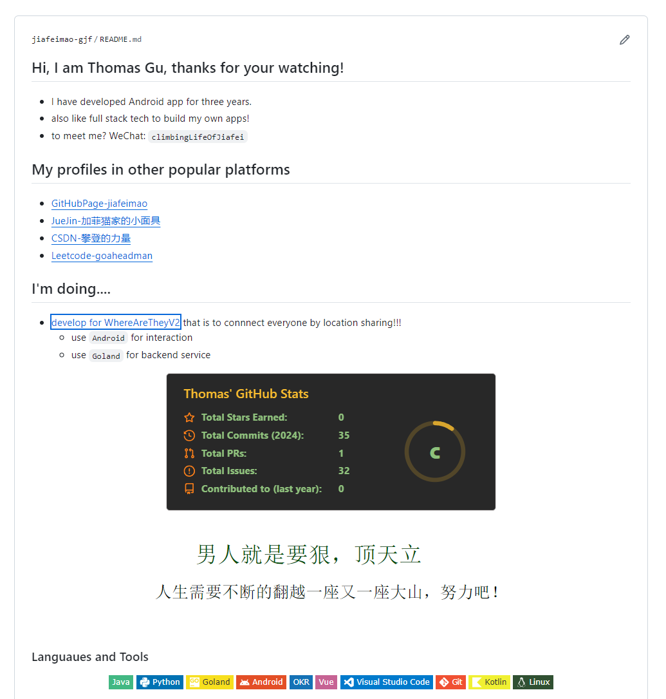

【总结】离职后一个月居家的31天
===
5月是一个集学习、社交、开发、面试、自我反思的一个月，首先在月初规划了自己的的5月计划，通过月-周-日的格式进行每天的规划和执行。

[2024-05 —日周报-顾家飞](https://so8b1opux5.feishu.cn/docx/CLn9dc6ouoDnUhx2SsOc9lSJnLb)

# 1. 5月计划
## 1.1 All in 学习和面试

通过规律作息和运动保持好精力，同时专心学习和复习，不断面试复盘，争取拿到一个offer。

 **自我提升**

- 面试技巧学习，这里推荐掘金的一个小册子（[技术人求职指南](https://juejin.cn/book/7211868947363135545?enter_from=course_center&utm_source=course_center)）
- 简历优化和review
- 专业技能复习和提升：计算机基础、Java、Android等八股文搜集和学习
- 项目开发：客户端&后端，全面重构和开发以前自己开发的一款app（[他们在哪？](https://github.com/jiafeimao-gjf/WhereAreTheyV2)）

**投简历和面试&面试总结**

- 梳理各大厂社招相关岗位JD
- 通过各种渠道进行投简历
- 约面试
- 面试总结

## 1.2 保持运动

- 早睡早起
- 晨跑
- 饮食控制摄入量

## 1.2 表达和沟通能力提升

- 看哔哩哔哩上的一些表达技巧
- 面试过程中，录音复盘，针对自己的表达问题，进行改正

# 2. 每周总结记录

## 2.1 第一周 4.29-5.5

第一周不怎么顺利，因为刚开始的几天，我爸在老家，他养的缅因猫离家出走了，我很是着急，各种渠道进行寻求帮助，包括：找猫平台发帖、找初中同学在家附近找、让我爸多去找找等。

最后还好，小面具自己回家了

本周主要做事情有：

- 看博客写笔记 [【输入】看博客、课程等学习记录总结](https://so8b1opux5.feishu.cn/docx/KQ4kdpNtpo6hlIxa8JNcpADNn9d)
- 看[技术人求职指南](https://juejin.cn/book/7211868947363135545?enter_from=course_center&utm_source=course_center) 写笔记
- 梳理自己的求职目标和搜集各大厂的JD:[客户端招聘JD研究](https://so8b1opux5.feishu.cn/docx/SQKHdzXY9oXrpnxKIxgcIxIynAg)
- 日常刷leetcode

这周最大的收获是[掘金平台](https://juejin.cn/)，真的不错，里面很多好的技术博客可以挖掘和学习。

掘金的浏览器插件也很推荐：[首页插件](https://juejin.cn/extension?utm_source=jj_nav)，好用点:

- 可以方便看自己感兴趣方向的高质量的博客
- 可以关注自己偏好语言的的github优质开源仓库

## 2.2 第二周 5.6-5.12

这周做了很多事情：

- 八股文研读和理解记忆，也总结了文档:[Java & Android八股文问题总结](https://so8b1opux5.feishu.cn/docx/Ip1Md1al2oYBkPx5CheculzEnng)
- 看了一篇大前端技术趋势微信文章，很有启发：[选型分析：深入分析App主流各大跨平台框架](https://mp.weixin.qq.com/s/I2BMm3m9Ffzu8qz6PYmTUA)
- 日常刷 leetcode
- 他们在哪app 第一版 本地跑通，建一个go后端的项目，搭建出简单的框架
- 复盘了一下4月的几个面试（拼多多、淘天），反思了不足、总结了一些todo

其实这周规划了很多事情想去做，但是思维太发散也不行，得聚焦做重要的事情。有两个重要的方向没什么进展：

**实践驱动技术学习：**鸿蒙开发、大模型开发、了解车载系统开发、学习Android必备开发能力（JNI开发、Compose、Flutter、页面架构实践等）

**造轮子计划：**
轮子：将自己的创意用程序实现，写成工具，发布到github平台和博客平台，造福广大热爱计算机的同学们，大到一个框架，小到一个程序文件等。那我可以贡献什么轮子呢？不能为了造轮子而造轮子，要造出别人想不到的轮子。

## 2.3 第三周 5.13-5.19

这周除了学习和刷题，还有就是开始投递简历约面试了（原因是更新了boss直聘的状态、一堆沟通要简历的）。还有就是**开始社交**，加了一些写博客的博主、b站的独立开发up主微信、进行沟通和交流。感觉多和人交流，自己的心态、心情都会有很大的变化，收益很多。

这周特地整理了计算机网络的知识：[计网-面试题复习](https://so8b1opux5.feishu.cn/docx/HQDbduvxloGI39xtY8ScUBXRnMc)

面试了得物，整理了面试复盘文档。有很多不足：问题回答的逻辑性、对一些Android核心的知识点（启动流程、binder、多进程通信、编译流程等）理解的还不够。Kotlin语言的学习和掌握也不够。

## 2.4 第四周 5.20-5.26

这周集中进行了很多面试，包括：聚好看、OPPO、外企、同花顺、1688、蚂蚁、阿里云

这周也额外理解学习了很多内容：
- [Android BInder机制深入探究学习](https://so8b1opux5.feishu.cn/docx/YowZdSQWaopCxlxtGM9cJO6UnzF)
- 整理简历内容，预测可能的面试题
- 刷算法题 刷代码随想录-总结笔记

总结梳理了Android面经总结：[【面经总结】Android客户端 ](https://so8b1opux5.feishu.cn/docx/ZnxSdjQhroIp19xABJTcZbuSnRc)

## 2.5 第五周 5.27-6.2

这周着重进行了面试复盘和研究：**到底怎么搞定社招，拿到offer？**

同时也进行了一些二面和面试总结，也有一面的公司：快手、大疆、拼多多。

放松的时候，整理了一下自己的
[GitHub主页](https://github.com/jiafeimao-gjf):

搞了科学上网工具，可以愉快的看[google Android源码](https://cs.android.com/android/platform/superproject/main)了，太开心了！

感觉这周没学习啥，除了刷题，面试之前都是在焦虑。所以我也反思了这一点：如何摆脱面试之前的焦虑？

深入思考了下，有以下三点：

- 第一：要保持平常心，深呼吸，暗示自己面试就是一场陌生人相互认识的过程。
- 第二：面试过程中，聚焦于面试官的问题即可，积极思考，有逻辑性的表达。
- 第三：保持好心态，没什么事情是能够很顺利的做好，包括面试，咱尽力就行。面试完进行复盘总结进步的，要用长远的眼光看自己。

# 3. 5 月总结

5月一个月没有上班了，爽是真的爽。

## 3.1 **运动、作息和学习**

每天早睡早起（7点起床、7个小时睡眠）运动、都可以开启元气满满的一天（除了下雨天，只能在家蹬动感单车了，真的难受）。但是，也有很多事情要做，需要认真执行学习计划，那种达到心流状态，真的很充实，很快乐。

有个关键问题：不够专注，容易走神，任务执行拖延。这个问题非常严重，必须深入分析，输出解决方案。

分析下来有一些干扰因素：
- 手机
- 哔哩哔哩
- 社交
- 下雨天等等

其实很简单，它们干扰我，我远离他们就行了，减少干扰噪音，增加白噪音（轻音乐等），多去专注的做事情，培养自己专注做事的习惯，感受那种心流的快乐。

## 3.2 **面试和面试复盘**：

一开始面试表现差强人意，到后来面试沉着冷静，取得了一点进步。其中，面试总结复盘还是很重要的，一方面总结复盘面试题和加强八股文学习、另一方面自己对沟通表达的更加的熟练。

一场好的面试沟通，对于面试官和候选人都是一次快乐的交流，所以会面试（面试别人、被别人面试）很重要。因为面试官很可能是你以后的同时，或者聊的来成为了朋友。

## 3.3 发展社交，积累人脉

人脉真的很重要，因为人与人之间的灵魂交流真的快乐，彼此近况的交流，然后给一些建议，结合自己的思考去执行实施，然后获得成长。

- 三个写博客的大佬：实施输出倒逼输入的方法论
- 一个腾讯离职的：也在学习和提升，找offer